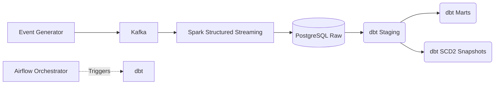

# ShopPulse: Idempotent E-commerce Analytics Pipeline

ShopPulse is an end-to-end event-driven data platform that ingests real-time e-commerce user activity, processes it through streaming analytics, and models it for business intelligence using a medallion architecture.

## Architecture

## What it does
ShopPulse simulates real-time user clickstream data and ingests it into a scalable Kafka topic. Spark Structured Streaming consumes these events and performs upsert-based writes into a raw PostgreSQL database, ensuring that data is persisted reliably. Airflow then orchestrates `dbt` to transform this raw data into clean staging and mart models, while capturing user history via slowly changing dimensions (SCD2).

## Tech Stack
* **Ingestion:** Python Event Generator, Kafka, Zookeeper
* **Streaming:** Spark Structured Streaming
* **Storage:** PostgreSQL 16
* **Transformation/Modeling:** dbt (data build tool)
* **Orchestration:** Apache Airflow
* **Containerization:** Docker Compose

## How to run
1. Ensure `.env` is configured with `POSTGRES_USER`, `POSTGRES_PASSWORD`, and `POSTGRES_DB`.
2. Run `docker compose up -d --build`.
3. Access Airflow UI at [http://localhost:8080](http://localhost:8080).
4. View PostgreSQL on port `5432` and Kafka on port `9092`.

## Design Decisions
* **Idempotent Writes:** Using `ON CONFLICT` constraints ensures that if Spark restarts or re-reads an offset, data is never duplicated in the raw tables.
* **Medallion Layering:** Data flows from Raw -> Staging -> Marts, ensuring clear separation between source-conformant data and business-ready models.
* **SCD2 via Snapshots:** We use dbt snapshots to track historical changes (e.g., user status updates) over time.
* **Reprocessing Safety:** Because our write operations are idempotent, the pipeline is inherently safe to reprocess without complex checkpoint durability, simplifying recovery operations.